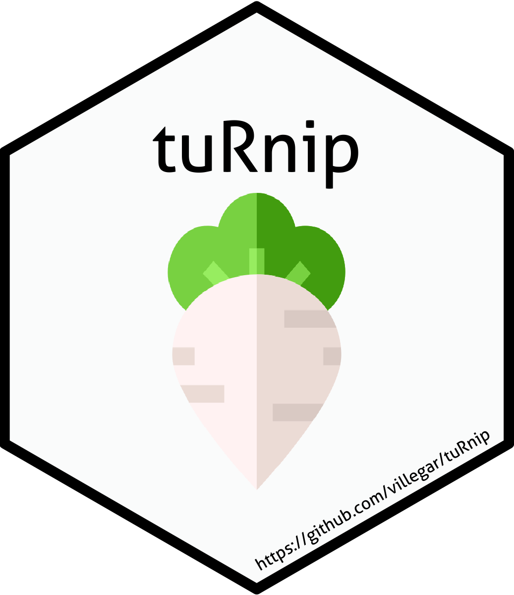

<!-- README.md is generated from README.Rmd. Please edit that file -->

```{r, include = FALSE}
knitr::opts_chunk$set(
  collapse = TRUE,
  comment = "#>",
  fig.path = "man/figures/README-",
  out.width = "100%"
)
```

# tuRnip 

tuRnip: Animal Crossing New Horizons Turnip Prices Tracker

<!-- badges: start -->
`r badger::badge_devel("villegar/tuRnip", "yellow")`
`r badger::badge_github_actions("villegar/tuRnip")`
`r badger::badge_cran_release("tuRnip", "black")`
<!-- badges: end -->

The goal of tuRnip is to ...

## Installation

You can install the released version of tuRnip from [CRAN](https://CRAN.R-project.org) with:

``` r
install.packages("tuRnip")
```

And the development version from [GitHub](https://github.com/) with:

``` r
# install.packages("devtools")
devtools::install_github("villegar/tuRnip")
```

## Example
